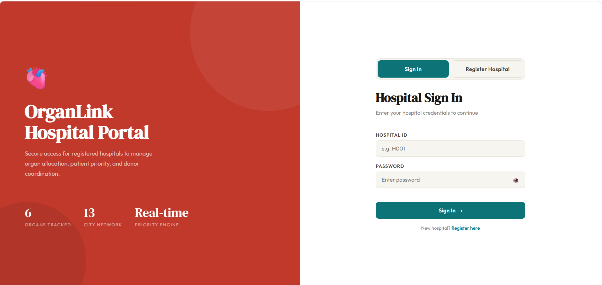
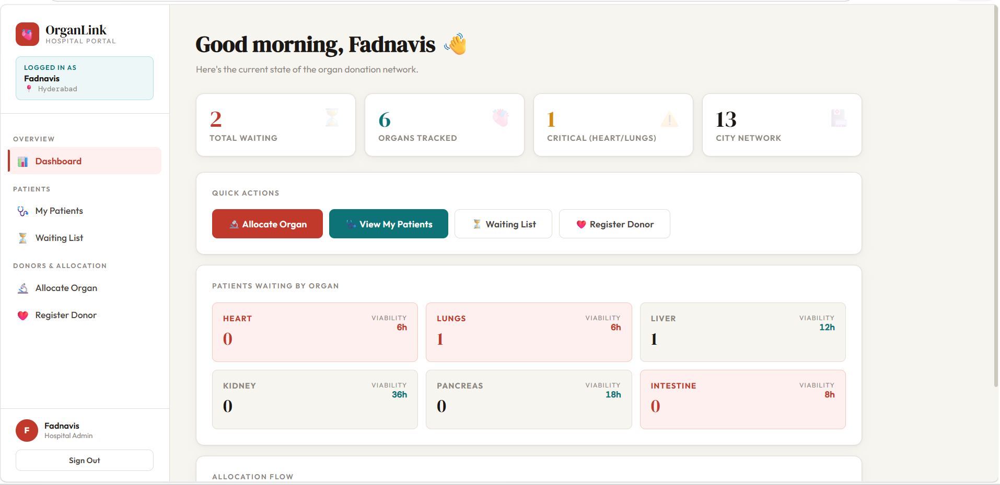
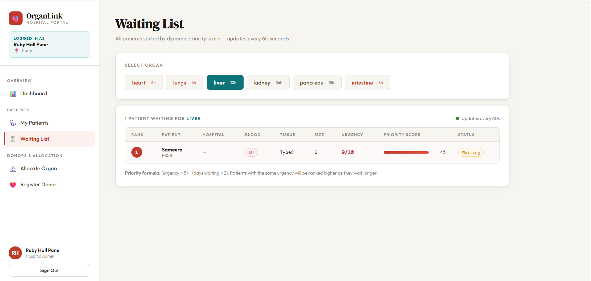
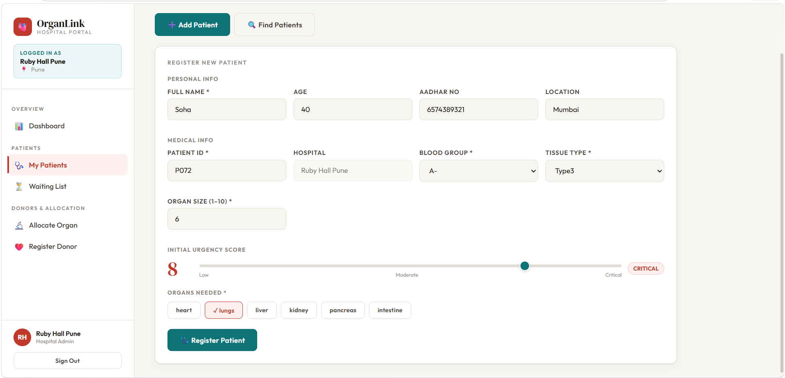
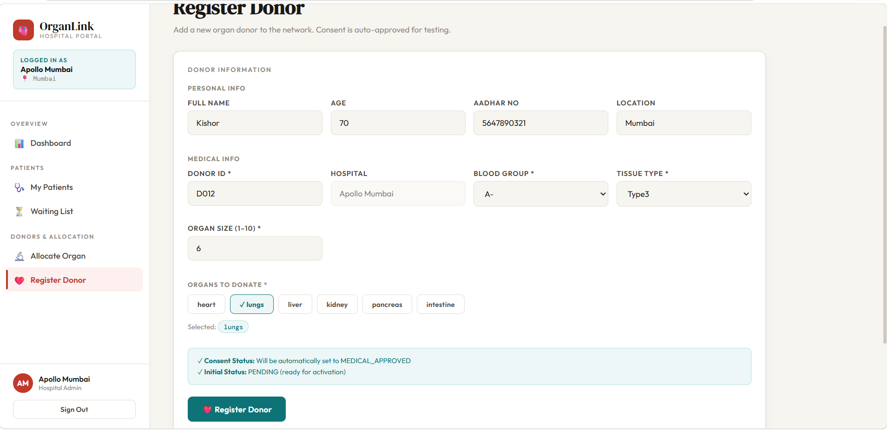
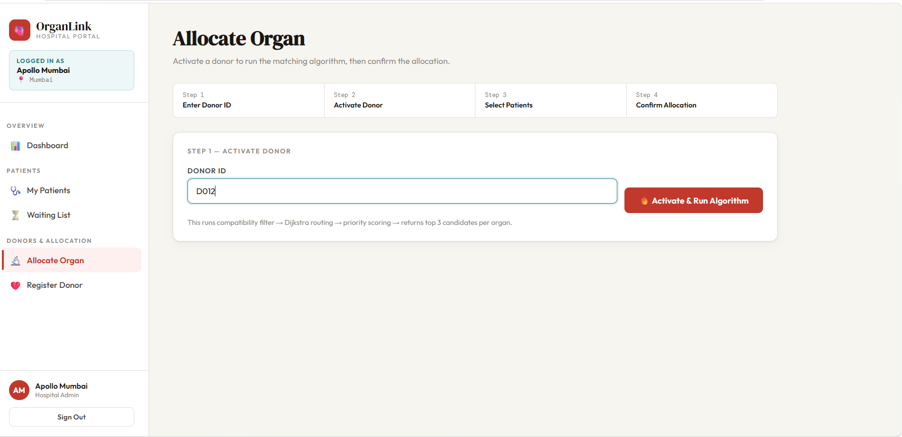
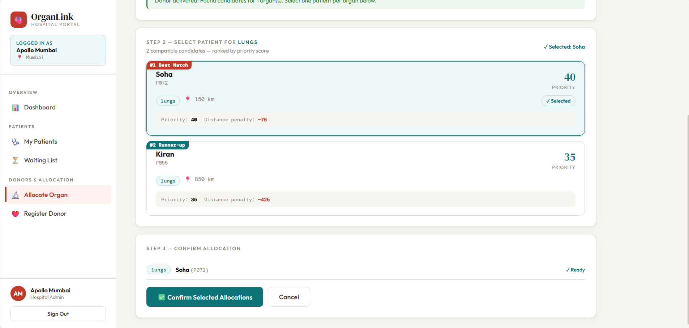
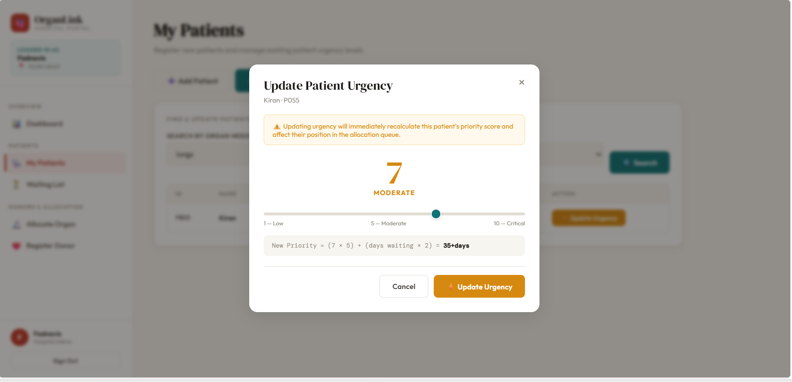

## Project Description

# 🫀 OrganLink — Organ Donation & Allocation System

A full-stack organ donation management system built with **Spring Boot**, **React**, and **MySQL**. It uses **Dijkstra's algorithm** for transport routing and a **dynamic priority engine** that automatically ranks patients based on urgency and waiting time.

---

## 📸 Preview

| Hospital Portal Login | Dashboard | Allocate Organ |
|---|---|---|
| Hospital sign-in with credentials | Live organ waiting counts | Top-3 candidate selection |

---

## ScreenShots

- Register/Login Hospital
    

- Dashboard
    

- Waiting List
    

- Patient Registration
    

- Donor Registration
    

- Activate Donor
    

- Allocate Patient
    

- Update Urgency
    


## Project Structure

```
Organ_Donation_clone/
│
├── springbooth/                  ← Spring Boot Backend (Java)
│
├── organ-donation-frontend/      ← Admin Panel (React + Vite)
│
└── organ-hospital-portal/        ← Hospital Portal (React + Vite)
```

---

## ✨ Features

### 🔬 Core Algorithm
- **Dijkstra's Algorithm** — calculates shortest transport distance between hospital cities across a 13-city Indian network
- **Dynamic Priority Engine** — patient scores update automatically every 60 seconds based on urgency + real waiting time
- **Compatibility Filter** — matches donors to patients by blood group, tissue type, and organ size (±2 tolerance)
- **Top-3 Candidate Selection** — returns best 3 matches per organ for doctor review instead of auto-allocating

### 🏥 Hospital Portal
- Secure hospital login (session-based)
- Register and manage patients with urgency scoring
- Real-time waiting list sorted by dynamic priority
- Activate donors and review allocation candidates
- Update patient urgency as condition changes


### DashBoard
- Add donors and patients
- Search patients by organ
- Trigger organ allocation


## 🛠️ Tech Stack

| Layer | Technology |
|-------|-----------|
| Backend | Java 17, Spring Boot 3, Spring Data JPA |
| Database | MySQL 8, Hibernate |
| Scheduling | Spring `@Scheduled` (priority updates every 60s) |
| Frontend | React 18, Vite 5 |
| Styling | Pure CSS (custom design system) |
| Algorithm | Dijkstra's Shortest Path  |

---

## ⚙️ Backend Setup

### Prerequisites
- Java 17+
- Maven
- MySQL 8

### 1. Configure Database

Open `springbooth/src/main/resources/application.properties`:

```properties
spring.datasource.url=jdbc:mysql://localhost:3306/organdonation
spring.datasource.username=root
spring.datasource.password=yourpassword
spring.jpa.hibernate.ddl-auto=update
spring.jpa.show-sql=true
```

Create the database in MySQL:
```sql
CREATE DATABASE organdonation;
```

### 2. Run the Backend

```bash
cd springbooth
./mvnw spring-boot:run
```

Backend starts on **`http://localhost:8080`**

---

## 💻 Frontend Setup

### Hospital Portal (Main UI)

```bash
cd organ-hospital-portal
npm install
npm run dev
```

Opens at **`http://localhost:3000`**


---

## 🔑 Demo Login Credentials (Hospital Portal)

| Hospital ID | Password | Hospital Name | City |
|-------------|----------|---------------|------|
| H001 | apollo123 | Apollo Mumbai | Mumbai |
| H002 | aiims123 | AIIMS Delhi | Delhi |
| H003 | ruby123 | Ruby Hall Pune | Pune |
.

---


## 🔄 Complete Flow

```
1. Register Hospital      → POST /hospital/register
        ↓
2. Add Patients           → POST /patient/add
   (clock starts, priority calculated, status = WAITING)
        ↓
3. Background Scheduler   → runs every 60s, updates all patient priorities
        ↓
4. Register Donor         → POST /donor/add
   (auto consent-approved, status = PENDING)
        ↓
5. Activate Donor         → POST /donor/activate/{id}
   → Compatibility filter (blood, tissue, organ size)
   → Dijkstra distance calculation
   → Score & rank patients
   → Return top 3 per organ
        ↓
6. Doctor Reviews Top 3   → Hospital Portal UI
        ↓
7. Confirm Allocation     → POST /allocation/accept
   (patient = ALLOCATED, donor = ASSIGNED)
```

---


## 🚧 Known Limitations / Future Improvements

- [ ] Real JWT-based hospital authentication (currently session-based demo)
- [ ] Email/SMS notification on allocation confirmation
- [ ] Audit log for all allocation events
- [ ] Multi-organ single donor → allocate each organ independently

---


